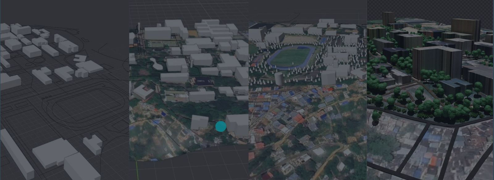

# UIS-Render

# 🧠De 2D a gemelos digitales: Creación automática de entornos 3D con IA
## 👨‍💻Autores

- Mandius Fonseca
- Santiago Amaya
- Santiago Salamanca
- Giojan David

## 🚀Acerca nuestro proyecto:
Este proyecto busca transformar imágenes satelitales y fotografías 2D de la Universidad Industrial de Santander (UIS) en un gemelo digital 3D del campus. Para lograrlo, combinamos tres frentes de trabajo:

- **Segmentación de instancia con IA**: usamos modelos de machine learning (SAM3) para identificar automáticamente edificios, vegetación, vías y zonas deportivas a partir de Iimágenes satelitales del campus.
- **Enriquecimiento con datos OSM**: cruzamos la segmentación con información vectorial de OpenStreetMap (footprints de edificios, vías, vegetación) para refinar y corregir las clasificaciones automáticas.
- **Reconstrucción 3D con nubes de puntos**: mediante fotogrametría (COLMAP), generamos nubes de puntos densas de edificios específicos del campus a partir de fotografías tomadas a pie, que luego usamos para extraer texturas realistas.

El resultado final integra la clasificación semántica, los modelos 3D generados por extrusión y las texturas reales, produciendo un mapa 3D y fiel del campus universitario.

## 🎯Objetivo:
Generar un mapa 3D de la UIS a partir de imágenes satelitales, combinando modelos de machine learning, datos OSM y reconstrucciones de texturas de edificios a partir de nubes de puntos. 
## 💻Instrucciones de uso:
